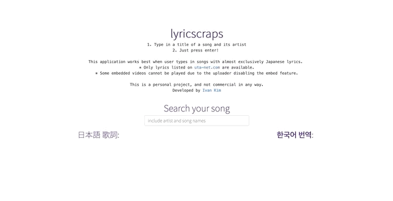

# lyricscraps

**https://lyricscraps.herokuapp.com/**

Since freshman, I learnt Japanese mostly by listening to Japanese bands and trying to translate their lyrics. While now proficient enough to understand most of the lyrics, it is still a hassle to copy paste Japanese titles (typing Japanese kanji is hard...) from Youtube and google them through obscure Japanese links for lyrics. So I thought, why not automate it to save myself the hassle?

**lyricscraps** is a Single Page Application that automatically embeds a Youtube video for a Japanese song, translates its Japanese lyrics to Korean lyrics, then update them on the page. It uses mostly vanilla **HTML/CSS/JS** for frontend and **Flask** for REST API calls and web scraping. There is no database or OAuth involved.

This is a personal project, and not commercial in any way.

# How to use:

Type in a title of a song (preferrably with artist name for better results), and just press enter!

Some disclaimers:

- This application works best when user types in songs with almost exclusively Japanese lyrics.

- It might happen that lyrics from some songs cannot be reached; this is because the lyrics are not listed on [uta-net.com](https://www.uta-net.com//) (pretty much the largest databse on Japanese song lyrics).

- Some embedded videos cannot be played due to the uploader disabling the embed feature.

- Due to Youtube Data API policy, only 100 searches in total are allowed in one day.

# Tech stacks:

- HTML5
- CSS3 + Bootstrap
- Javascript
- Flask (Python)
- Web Scraping (Beautifulsoup4 library)
- [Youtube Data API v3](https://developers.google.com/youtube/v3/)
- [Kakao i Translation API](https://developers.kakao.com/product/translation)

This application works by:

1. Search videos with user query through **Youtube Data API**, returning embed video link and its title (retaining original Japanese characters)
2. Search google with the returned video title, and web scrap with **Beautifulsoup** (python library) to find urls from uta-net.com that is most relevant with the query.
3. Translate the Japanese lyrics to Korean lyrics through **Kakao i Translation API**.

# To work on:

- implement React
- extend language type support
- diversify lyrics sources for reliable web scraping
